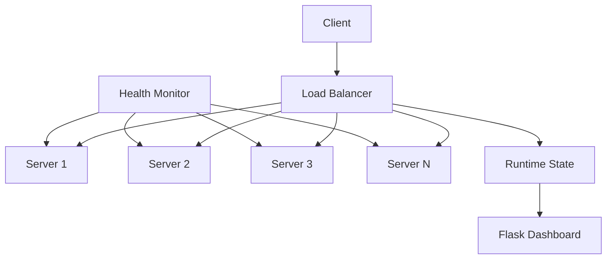

# Smart Load Balancer with Health Monitoring

A Python-based load balancer that dynamically distributes client requests across multiple backend servers using **Round Robin** and **Least Connections** algorithms, with server health monitoring and a Flask-based dashboard.

## Features

* **Round Robin** and **Least Connections** request routing
* **Health monitoring** to detect and bypass unavailable servers
* **Concurrent request handling** using Python threading
* **Dynamic server state tracking** — health, active connections, and requests
* **Flask dashboard** for real-time server monitoring
* Supports multiple backend server instances

## Architecture



## How It Works

1. The client sends a request to the load balancer.
2. The load balancer checks the health of available backend servers.
3. The configured load-balancing algorithm selects a healthy server.
4. The request is forwarded to the selected backend server.
5. The server processes the request and returns the response.
6. Runtime server state is updated.
7. The Flask dashboard displays the current server status and request activity.

## Load Balancing Algorithms

### Round Robin

Requests are distributed sequentially among available servers.

```text
Request 1 → Server 1
Request 2 → Server 2
Request 3 → Server 3
Request 4 → Server 4
Request 5 → Server 1
```

Unavailable servers are skipped during request routing.

### Least Connections

Each request is routed to the healthy server with the **lowest number of active connections**.

```text
Server 1 → 3 connections
Server 2 → 1 connection
Server 3 → 4 connections
Server 4 → 2 connections

New Request → Server 2
```

This allows request distribution to adapt to the current server workload.

## Health Monitoring

The health checker continuously monitors backend servers.

```text
Backend Servers
      │
      ▼
Health Check
      │
 ┌────┴────┐
 ▼         ▼
Healthy    Down
 │          │
 ▼          ▼
Available  Bypass
```

If a server becomes unavailable, the load balancer automatically avoids routing requests to it.

## Tech Stack

* **Python**
* **Flask**
* **Python Threading**
* **HTTP**
* **JSON**
* **HTML / CSS / JavaScript**

## Running the Project

### 1. Clone the repository

```bash
git clone <repository-url>
cd dynamic-load-balancer
```

### 2. Create a virtual environment

```bash
python -m venv venv
```

Activate it on Windows:

```bash
venv\Scripts\activate
```

### 3. Install dependencies

```bash
pip install -r requirements.txt
```

### 4. Start the backend servers

Run the configured backend server instances:

```bash
python servers/server1.py
python servers/server2.py
python servers/server3.py
python servers/server4.py
```

### 5. Start the load balancer

```bash
python load_balancer/balancer.py
```

### 6. Start the dashboard

```bash
python visualizer/app.py
```

Open the Flask dashboard in your browser using the address shown in the terminal.

## Testing

Generate requests using:

```bash
python tests/test_requests.py
```

The requests can be used to observe how the load balancer distributes traffic between the available backend servers.


